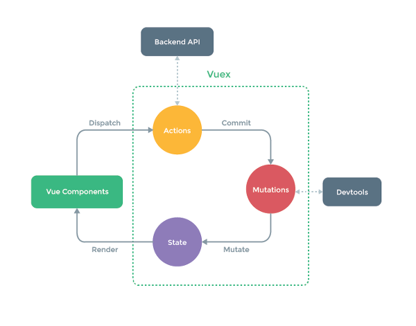

# vue.js 완벽가이드

  ## vue-router
  1. 설치
  > 프로젝트 디렉토리에서 아래와 같이 입력한다.
  ```sh
  vue add router
  ```
  2. dynamic router matching

  ## vuex
  1. 설치
  > 프로젝트 디렉토리에서 아래와 같이 입력한다.
  ```sh
  vue add vuex
  ```
  2. vuex 상태도  
  
      + state
      ```json
      state: {
        mydata: [],
      }
      ```
      + actions
        ```js
        actions: {
          FETCH_XXX(context) {
            context.commit('SET_XXX', data);
          }
        }
        ```
      + mutations
      ```js
      mutations: {
        SET_XXX(state, data) {
          state.mydata = data;
        }
      }
      ```
      + getters
      ```js
      getters: {
        getXXX(state) {
          return state.xxx;
        },
        fetchXXX(state) {
          return state.xxx;
        }
      }
      ```

  2. 모듈화
      + mutations.js
      + actions.js
  3.  aaa

  ## vuetify
  1. 

